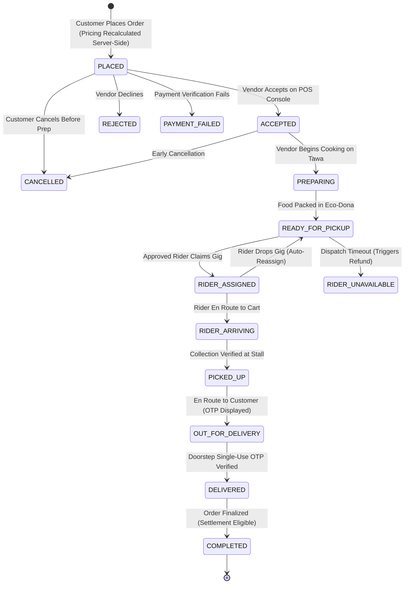
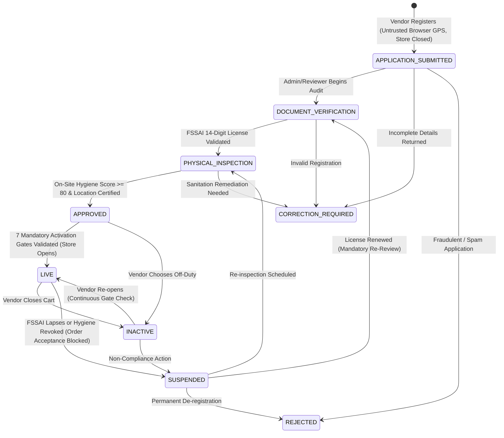

# Thela Express — Complete Version History & Architectural Changelog

**Product Name**: Thela Express  
**Platform**: Hyper-Local Quick Commerce Platform for Indian Street Food Stalls  
**Current Production Version**: `v2.0.4`  
**Current Date**: September 20, 2026  
**Git Repository**: [GitHub — Yooo6769/Thela-Express](https://github.com/Yooo6769/Thela-Express.git)  
**Live Production Deployment**: [Render — thela-express.onrender.com](https://thela-express.onrender.com)  
**Local Document Paths**:
- [VERSION_HISTORY.md](file:///C:/Users/anura/.gemini/antigravity/scratch/thela-express-prod/VERSION_HISTORY.md)
- [ThelaExpress_Version_History.md](file:///C:/Users/anura/Desktop/ThelaExpress_Version_History.md) (on your Windows Desktop)

---

## 1. Architectural Progression Overview

---

## 2. Release-by-Release Detailed Breakdown

### `v1.0.0` — Genesis & Cloud Infrastructure Foundation
- **Release Date**: September 17, 2026
- **Git Commit**: `ec45110` (`feat: Initial commit for ThelaExpress 24/7 cloud deployment`)
- **Key Accomplishments**:
  - Full-stack Node.js and Express backend setup with native HTTP and WebSocket (`ws`) server integration.
  - Multi-portal architecture:
    - **Customer Web App (`public/index.html`)**: Mobile-first responsive storefront for street food discovery.
    - **Partner Console (`public/partner.html`)**: Dual-mode operational interface for street food vendors (POS order management) and delivery partners (gig claiming and navigation).
    - **Onboarding Portals (`public/onboard-vendor.html`, `public/onboard-rider.html`)**: Dedicated intake forms for food carts and delivery riders.
    - **Admin Backoffice (`public/admin.html`)**: Management console for inspecting stalls, auditing riders, and reviewing platform metrics.
  - Cloud deployment pipeline configured with Render (`render.yaml`), defining auto-deploy configurations and health check endpoints (`/api/health`).
  - JSON-based persistent storage engine (`server/data/thela.db.json`) with atomic file writes.

---

### `v1.1.0` — Universal 12-Language Indian Localization (i18n)
- **Release Dates**: September 17–18, 2026
- **Git Commits**: `ea5344e`, `e227fcd`
- **Key Accomplishments**:
  - Built universal client-side internationalization dictionary (`public/i18n.js`) covering **12 major Indian languages**:
    - **English** (`en`), **Hindi** (`hi` — हिन्दी), **Bengali** (`bn` — বাংলা), **Marathi** (`mr` — मराठी), **Telugu** (`te` — తెలుగు), **Tamil** (`ta` — தமிழ்), **Gujarati** (`gu` — ગુજરાતી), **Kannada** (`kn` — ಕನ್ನಡ), **Malayalam** (`ml` — മലയാളം), **Punjabi** (`pa` — ਪੰਜਾਬੀ), **Odia** (`or` — ଓଡ଼ିଆ), **Assamese** (`as` — অসমীয়া).
  - Engineered zero-reload, reactive DOM translation engine with declarative `data-i18n` HTML attributes.
  - Persistent language preference storage in browser `localStorage`.
  - Automated dictionary audit script (`scratch/test_all_i18n.js`) enforcing zero missing translation keys across all 5 applications.

---

### `v1.2.0` — Two-Tier Street Food Trust Architecture & Infrastructure Hardening
- **Release Date**: September 18, 2026
- **Git Commits**: `ec59eb6`, `076ecd7`, `8416ab7`, `9c0f5e2`
- **Key Accomplishments**:
  - Architected **Two-Tier Vendor Trust Model**, strictly separating regulatory paperwork from operational sanitation:
    - **Tier 1 (FSSAI Regulatory Audit)**: 14-digit government registration validation, certificate status tracking (`submitted`, `verified`, `expired`, `rejected`), expiry date tracking, and direct national portal links.
    - **Tier 2 (Physical Hygiene Audit)**: On-site inspection checklist covering Reverse Osmosis (RO) drinking water usage, covered glass food carts, food-grade packaging (*donas* and wrappers), clean oil reheating practices, and cart sanitization (audit score 0–100, requiring $\ge 80$).
  - Enhanced Admin Backoffice with verification action drawers for FSSAI review and field audit logging.
  - Created 1-click cloud VPS deployment scripts (`deploy-vps.sh`), Nginx reverse proxy configuration, PM2 process management (`ecosystem.config.js`), and Windows batch push tools (`Push-To-GitHub.bat`).

---

### `v1.3.0` — Customer Discovery Experience & Zero-Fiction Delivery Claims
- **Release Date**: September 18, 2026
- **Git Commits**: `7195f4a`, `1ce5583`
- **Key Accomplishments**:
  - Redesigned customer interface around genuine street food cravings: craving search bar and interactive category chips (Chaat, Rolls, Tandoor, Sweets, Beverages, South Indian, Momos).
  - Introduced 6 horizontal curated discovery sections: Trending, Popular, Under ₹100, Legendary Stalls, Late Night, and Hidden Gems.
  - **Eradication of Fictional Delivery Claims**:
    - Eliminated static marketing promises ("15-minute delivery", "14-min guarantee") that misled customers.
    - Implemented dynamic calculation: straight-line Haversine distance engine, vendor food preparation time, transit calculations, and platform load buffers.
    - Added neutral fallback states ("ETA available after location") when customer coordinates or vendor data are not yet established.

---

### `v1.4.0` — Authentic Street Vendor Profile Experience & Data Cleanliness
- **Release Date**: September 18, 2026
- **Git Commits**: `4659572`, `24184c6`
- **Key Accomplishments**:
  - Dedicated Vendor Detail Modal and storefront view:
    - Prominent verification badge display (FSSAI verified, Hygiene audited score, on-site verified location).
    - Authentic vendor heritage storytelling ("About this Cart", years operating, secret family spice blends).
    - Signature dishes showcase ("Famous For" badge), categorized food menus, and vegetarian/non-vegetarian toggles.
    - Persistent floating checkout bar and cart drawer.
  - **Sensitive & Demo Data Purge**:
    - Removed all hardcoded test OTP bypasses (`9999`) and mock geolocation coordinates.
    - Restricted tracking screen to actual system dispatch estimates rather than fabricated driver simulations.

---

### `v1.5.0` — Street-Food Atmosphere & State-Driven Adaptive Density
- **Release Date**: September 19, 2026
- **Git Commits**: `1fd2de5`, `bfac3b1`
- **Key Accomplishments**:
  - Created **AtmosphereManager** visual system reflecting lively Indian night-market culture:
    - Warm spice color palettes (turmeric amber, deep masala red, fresh coriander green, cardamom gold).
    - Vector street food motifs (tawa spatulas, sizzling steam curls, earthen cups/kulhad, neon night signs).
  - Built **4-Level State-Driven Adaptive Density Engine**:
    - `compact`: Dense information layout for mobile viewports and order-heavy screens.
    - `normal`: Balanced spacing for desktop browsers.
    - `spacious`: High-readability layout for touch devices and elderly vendor access.
    - `minimal`: Background-suppressed mode activated automatically when modal stacks or drawers are open.
  - Hardware awareness: respects user `prefers-reduced-motion` and scales down animation loops during low-battery or performance constraints.

---

### `v1.6.0` — Food Photography Hierarchy & Pure Dynamic Discovery
- **Release Date**: September 19, 2026
- **Git Commits**: `c4a4534`, `bb15488`, `e793837`
- **Key Accomplishments**:
  - Implemented **3-Tier Visual Menu Hierarchy**:
    - **Signature Dishes**: Full-width hero photography cards with ingredient callouts, heat levels, and awards.
    - **Bestsellers**: Medium-sized cards with quick-add counters and customization tags.
    - **Regular Items**: Streamlined list cards maximizing vertical scanning speed.
  - Dynamic SVG food placeholder generator (`getThelaFoodPlaceholder`) providing authentic vector illustrations for stalls without professional photography.
  - **Pure Dynamic Discovery & Complete Demo Elimination**:
    - Completely emptied `CURATED_DISCOVERY` in `public/app.js` (removed 24 mock craving cards).
    - Updated discovery section rendering logic: horizontal tracks hide completely (`classList.add('hidden')`) when zero live matching vendors exist.
    - Purged `server/data/thela.db.json` of all mock vendors, demo tokens, and dummy ratings.
    - Enforced that customer discovery only displays authentic street food stalls registered in the database.

---

### `v1.7.0` — Dynamic Delivery ETA Engine & Fleet Telemetry
- **Release Date**: September 19, 2026
- **Git Commits**: `8b5e8a6`, `bcbaa33`
- **Key Accomplishments**:
  - Mathematical delivery estimation algorithm:
    $$\text{ETA}_{\text{min}} = \text{PrepTime}_{\text{vendor}} + \left(\frac{\text{Distance}_{\text{km}}}{18\text{ km/h}} \times 60\right) + \text{Buffer}_{\text{fleet}}$$
    $$\text{ETA}_{\text{max}} = \text{ETA}_{\text{min}} + 7\text{ minutes}$$
  - Dynamic fleet capacity telemetry (`getDeliveryCapacity`): scales buffer time proportionally based on active rider availability vs. pending active order queues.
  - Rendered consistent, frosted ETA badges across discovery cards, stall detail drawers, and the cart summary.
  - Guarded against phantom distance leaks: if customer location or vendor coordinates are missing, UI displays neutral `"ETA unavailable"` rather than guessing.

---

### `v1.8.0` — Centralized Order Lifecycle Engine & Concurrency Safety
- **Release Date**: September 19, 2026
- **Git Commit**: `540e405`
- **Key Accomplishments**:
  - Established canonical **10-stage order progression**:
    $$\text{PLACED} \to \text{ACCEPTED} \to \text{PREPARING} \to \text{READY\_FOR\_PICKUP} \to \text{RIDER\_ASSIGNED} \to \text{RIDER\_ARRIVING} \to \text{PICKED\_UP} \to \text{OUT\_FOR\_DELIVERY} \to \text{DELIVERED} \to \text{COMPLETED}$$
  - Enacted 5 terminal failure states: `PAYMENT_FAILED`, `VENDOR_UNAVAILABLE`, `REJECTED`, `CANCELLED`, `RIDER_UNAVAILABLE`.
  - **Optimistic Concurrency Control (OCC)**:
    - Every order entity maintains a monotonic integer `version`.
    - State transition requests require `expectedVersion`. Conflicting simultaneous updates fail with `HTTP 409 Conflict`.
  - **Single-Use Doorstep Delivery OTP**:
    - Generated randomly upon order placement and encrypted at rest with AES-256-GCM (`OTP_SECRET`).
    - Stored in the database as salted SHA-256 hashes (`hashOtpWithSalt`). Raw OTP is never written to persistent storage.
    - Customer receives OTP only when status reaches `OUT_FOR_DELIVERY`.
    - Rate-limited verification locks after 5 consecutive incorrect attempts. Replay attacks on already-verified orders fail.
  - **Rider Reassignment & Unavailable Flow**:
    - If a driver drops a gig, the order reverts to `READY_FOR_PICKUP` for auto-reassignment without resetting vendor prep progress.
    - If dispatch times out, order transitions to `RIDER_UNAVAILABLE`, automatically initiating customer refund procedures.
  - Created comprehensive 22-test automated test suite (`scratch/test_order_lifecycle.js`).

---

### `v1.9.0` — Server-Authoritative Payments, Financial Ledger & Settlements
- **Release Date**: September 19, 2026
- **Git Commit**: `1088bbc`
- **Key Accomplishments**:
  - **Server-Authoritative Pricing Engine (`server/src/payments/pricing_engine.js`)**:
    - Discards all client-supplied prices, totals, taxes, commissions, and payment statuses.
    - Re-fetches current catalog prices from database, calculates item totals, applies tiered delivery fees and packaging fees, verifies coupons, isolates customer tips (100% passed to rider, 0% platform take), and computes payable grand totals server-side.
  - **Immutable Double-Entry Financial Ledger (`server/src/payments/ledger_service.js`)**:
    - Implemented append-only ledger (`financialLedger`) storing immutable financial transactions (`ORDER_PAYMENT`, `VENDOR_PAYABLE`, `RIDER_PAYABLE`, `PLATFORM_REVENUE`, `REFUND_ISSUED`, `ADJUSTMENT`).
    - Derived balances mathematically; existing ledger entries are never mutated.
  - **Settlement State Machine (`server/src/routes/settlements.js`)**:
    - Vendor and rider settlements initiate in `PENDING`.
    - Transition to `ELIGIBLE` strictly upon doorstep OTP verification (`DELIVERED`).
    - Transition to `PROCESSING` upon batch payout generation, and `PAID` upon bank UTR confirmation.
  - **Proportional Refund Engine**:
    - Supports full and partial item refunds. Reverses vendor payable proportionally for cancelled food while preserving rider delivery fees if pickup was already executed.
  - **EOD Financial Reconciliation Monitor**:
    - Validates platform mathematical invariant across all historical ledger rows:
      $$\sum \text{Customer Collected} = \sum \text{Vendor Settlements} + \sum \text{Rider Settlements} + \sum \text{Platform Net} + \sum \text{Refunds}$$
  - Created 19-test automated financial test suite (`scratch/test_payments_ledger.js`).

---

### `v2.0.0` — Server-Authoritative Vendor & Rider Activation Pipeline (Current Production)
- **Release Date**: September 19, 2026
- **Git Commit**: `8bf2187`
- **Key Accomplishments**:
  - **Onboarding Paradigm Shift ("Registration is an Application, Not an Approval")**:
    - Vendor registration strictly initializes stall in `APPLICATION_SUBMITTED` (`isOpen: false`, `location_verified: false`).
    - Rider registration strictly initializes rider in `APPLICATION_SUBMITTED` (`is_online: false`, `is_verified: false`).
    - Eliminated premature success claims ("Your cart is now live" / "You are now registered as a verified delivery partner"). Replaced with transparent verification journey roadmaps.
  - **The 7 Mandatory Server-Side Activation Gates (`validateVendorLiveActivationGates`)**:
    No stall can transition to `LIVE`—even via admin actions—without satisfying all seven gates:
    1. `verification_status === 'APPROVED'`: Operational approval by platform compliance reviewers.
    2. **Authoritative Contact Data**: Valid owner name and verified 10-digit Indian mobile number.
    3. **Physical Location Verification**: Certified on-site inspection (`location_verified === true`). Raw browser GPS is tagged as untrusted applicant evidence (`location_source: 'browser_applicant'`).
    4. **Active Menu Catalog**: At least one in-stock menu item with a valid price $> ₹0$.
    5. **Valid Payout Destination**: Conforming UPI ID format (`id@bank`).
    6. **Regulatory FSSAI Compliance**: `fssai_status === 'verified'` with non-expired expiry date.
    7. **Physical Hygiene Inspection**: `hygiene_status === 'verified'` with audit score $\ge 80$.
  - **Continuous Post-Activation Compliance (`checkStallCanAcceptOrders`)**:
    - Evaluates all 7 gates on every incoming order. If an FSSAI license lapses or hygiene audit is revoked post-activation, stall is immediately suspended and blocked from receiving orders.
  - **Mandatory Suspension Re-Review**:
    - Reinstatement from `SUSPENDED` cannot jump directly to `APPROVED` or `LIVE`. Requires re-review transition through `DOCUMENT_VERIFICATION` or `PHYSICAL_INSPECTION`.
  - **Rider Activation Pipeline**:
    - Progressive stages: `APPLICATION_SUBMITTED` $\to$ `IDENTITY_REVIEW` $\to$ `APPROVED` $\to$ `AVAILABLE`.
    - Unapproved riders are barred from toggling online or claiming delivery gigs.
  - **Applicant Token Scoping & Anti-Enumeration Security**:
    - Scoped tokens (`thela_tok_vendor_${stallId}`, `thela_tok_rider_${riderId}`) restricted to tracking the applicant's own status.
    - Cross-applicant status lookups rejected with `HTTP 403 Forbidden` prior to database queries, preventing ID enumeration.
  - **Architecture Refactor**:
    - Created `server/src/app.js` separating Express configuration from server listen logic for isolated unit and integration testing.
  - Created comprehensive 8-test activation test suite (`scratch/test_vendor_rider_activation.js`).

---

### `v2.0.1` — Partner Store Status Contradiction Resolution & Authoritative State Derivation
- **Release Date**: September 20, 2026
- **Git Commit**: `d67801c` (`fix(partner): resolve store status contradiction with server-authoritative state derivation and regression tests`)
- **Key Accomplishments**:
  - **Eliminated UI State Contradiction**:
    - Resolved the critical contradiction where the Partner Portal displayed green "Store Status: OPEN FOR ORDERS" alongside `APPLICATION_SUBMITTED`, "Kitchen POS Locked," and pending verification gates.
  - **Server-Authoritative State Engine (`db.getStallStoreStatus`)**:
    - Centralized all store status derivation into `server/src/db.js`, enforcing exact canonical labels:
      - `APPLICATION_SUBMITTED` $\to$ **`APPLICATION PENDING`**
      - `DOCUMENT_VERIFICATION` $\to$ **`VERIFICATION IN PROGRESS`**
      - `PHYSICAL_INSPECTION` $\to$ **`VERIFICATION IN PROGRESS`**
      - `CORRECTION_REQUIRED` $\to$ **`CORRECTION REQUIRED`**
      - `REJECTED` $\to$ **`APPLICATION REJECTED`**
      - `APPROVED` (not yet LIVE) $\to$ **`APPROVED — NOT LIVE`**
      - `INACTIVE` $\to$ **`INACTIVE`**
      - `SUSPENDED` $\to$ **`SUSPENDED`**
      - `LIVE` + `isOpen === false` $\to$ **`STORE CLOSED`**
      - `LIVE` + `isOpen === true` (all 7 gates pass) $\to$ **`OPEN FOR ORDERS`**
  - **Public Payload & Endpoint Guarantees**:
    - In `formatStallForPublic(stall)`, `isOpen` is forced to `storeStatus.isOpen`, ensuring unactivated stalls NEVER return `isOpen: true` to clients.
    - Added dedicated `GET /api/stalls/:id/status` endpoint.
    - Gated `PATCH /api/stalls/:id/toggle-open` to reject toggles on stalls not in `APPROVED`, `LIVE`, or `INACTIVE` with passing gates.
  - **Client-Side & Localization Sanitization**:
    - Removed `data-i18n="store_open"` from `vendorOpenLabel` in `public/partner.html` to prevent indiscriminate DOM overwrites by `applyTranslations()`.
    - Added neutral disabled initial state (`CHECKING STATUS...`).
    - Implemented reactive `renderStoreStatus(stall)`, `onVendorStallChange()`, and `toggleStallOpenStatus()` with live WebSocket synchronization.
    - Added localized status dictionary keys across all 12 Indian languages in `public/i18n.js`.
  - **Automated Regression Suite**:
    - Created `scratch/test_store_status_contradiction.js` (5 test suites validating all states, illegal toggle rejection, and static HTML invariants).

---

### `v2.0.2` — JS Hoisting Elimination, Zero-Cache Defense & Delivery Radius Alignment
- **Release Date**: September 20, 2026
- **Git Commit**: `d7506cd` (`fix(partner): eliminate hoisted functions, enforce no-cache headers, audit delivery radius, and bump v2.0.2`)
- **Key Accomplishments**:
  - **Eliminated JavaScript Hoisting Duplicates**:
    - Discovered and removed shadowed duplicate declarations of `onVendorStallChange` and `toggleStallOpenStatus` in `public/partner.js` that had been overwriting active methods at runtime with un-gated legacy code.
    - Embedded an unbreakable invariant guard into `renderStoreStatus(stall)` preventing any open label assignment unless `stall.status === 'LIVE' && stall.isOpen === true && storeStatus.canAcceptOrders === true`.
    - Integrated `renderStoreStatus(null)` in empty states to prevent stale state retention.
  - **Aggressive HTTP Cache Busting**:
    - Configured `express.static` with custom headers emitting `Cache-Control: no-cache, no-store, must-revalidate`, `Pragma: no-cache`, and `Expires: 0` for all `.html` and `.js` files.
    - Appended `?v=2.0.2` query parameters across script tags in all five portal HTML entrypoints.
  - **Delivery Radius Backend Alignment**:
    - Audited and purged all fixed "1.5 km" marketing copy from `public/onboard-rider.html` and `public/index.html`.
    - Exposed authoritative `serviceRules: { deliveryRadiusKm: 2.5, packagingFeeDefault: 10, deliveryFeeDefault: 0 }` via `GET /api/stalls/capacity`.
  - **Comprehensive Anti-Bypass Testing**:
    - Expanded `scratch/test_store_status_contradiction.js` to 7 full suites, proving zero duplicate hoisted functions, server-side override of tampered `isOpen` flags, and strict absence of hardcoded delivery radius text.

---

### `v2.0.3` — Universal Theme Engine & Background Colors (White, Black, System Default)
- **Release Date**: September 20, 2026
- **Git Commit**: `3512ba5` (`feat(theme): add universal background color engine supporting White, Black, and System Default across all 5 apps`)
- **Key Accomplishments**:
  - **Universal 3-State Theme Engine (`public/theme.js`)**:
    - Supports White (Light), Black (Dark), and System Default across all 5 applications.
    - Zero Flash of Unstyled Content (FOUC) via synchronous `<head>` bootloaders across all HTML portals.
    - Cross-tab synchronization via `storage` event listener.
    - Auto-detects and dynamically responds to host device OS dark/light mode toggles.
  - **Semantic Design Tokens (`public/theme.css`)**:
    - Root CSS variables with AMOLED deep black (`#09090b`) and pure daylight white (`#ffffff`).
    - Comprehensive dark overrides for cards, sticky headers, bottom navigation, modals, inputs, and dropdowns.
    - Adaptive styling for Admin Portal (`.admin-theme-adaptive`) transforming between dark operations and clean light dashboard.
  - **Header Theme Selector Widget (`.themeSelectorMount`)**:
    - Mounted directly alongside the 12-language selector across all 5 applications.
    - Status icon cues (☀️ Sun, 🌙 Moon, 💻 Desktop) and active checkmarks.
  - **Full 12-Language Support (`public/i18n.js`)**:
    - 4 theme keys (`theme_selector`, `theme_white`, `theme_black`, `theme_system`) added across all 12 Indian languages.
  - **Automated Verification (`scratch/test_themes.js`)**:
    - 46/46 automated assertions passing.

---

### `v2.0.4` — High-Contrast Dark Theme Readability & Mobile Viewport Overflow Containment
- **Release Date**: September 20, 2026
- **Git Commit**: `8be7e0c` (`fix(ui): high-contrast dark theme readability, stone palette overrides, and mobile viewport overflow containment (v2.0.4)`)
- **Key Accomplishments**:
  - **Stone, Zinc & Neutral Palette Contrast in Dark Mode (`public/theme.css`)**:
    - Diagnosed that Tailwind's `stone` palette (`text-stone-900`, `text-stone-800`, `text-stone-700`, `text-stone-600`, `text-stone-500`, `text-stone-400`, `bg-stone-50`, `bg-stone-100`, `border-stone-200`) was unstyled in dark mode, causing `#1c1917` near-black text to render invisibly on `#09090b` dark backgrounds.
    - Implemented comprehensive dark overrides with crisp `#f8fafc` text, `#cbd5e1` secondary labels, and `#202025` card surfaces.
    - Added universal contrast rules for all headings (`h1`–`h6`) in dark mode (`color: #f8fafc !important`).
    - Styled category pills (`.cat-pill`, `.cat-pill.active`), amber trust badges (`.bg-amber-50`, `.border-amber-200`), and empty-state containers for high contrast.
  - **Elimination of Mobile Viewport Horizontal Blowout ("Half-Empty Screen")**:
    - Diagnosed that unconstrained header controls (Language Selector, Theme Selector, Veg toggle, Cart button, Profile button, Location picker) expanded the header to 623px on 375px–393px mobile viewports, causing a 230px+ horizontal blowout where the right half of the screen appeared empty.
    - Added responsive compact mode in `theme.js` and `i18n.js`: label text is hidden on mobile (`hidden md:inline`), displaying only compact icons (☀️/🌙/💻 and 🌐) and reducing button width from ~105px to ~32px.
    - Enforced `overflow-x: hidden !important; max-width: 100vw !important; width: 100% !important;` in `theme.css` and added `w-full max-w-full overflow-x-hidden` across `index.html`, `partner.html`, `admin.html`, `onboard-vendor.html`, and `onboard-rider.html`.
  - **Automated Verification**:
    - Expanded `scratch/test_themes.js` with Suite 6; 53/53 tests passing.

---

## 3. Complete Git Commit Timeline

| Commit | Date | Category | Description |
| :--- | :--- | :--- | :--- |
| `8be7e0c` | 2026-09-20 | UI & Themes | High-contrast dark theme readability, stone palette overrides, and mobile viewport overflow containment (v2.0.4) |
| `3512ba5` | 2026-09-20 | Theme Engine | Add universal background color engine supporting White, Black, and System Default across all 5 apps |
| `d7506cd` | 2026-09-20 | Partner App | Fix: eliminate hoisted functions, enforce no-cache headers, audit delivery radius, and bump v2.0.2 |
| `d67801c` | 2026-09-20 | Activation | Fix partner store status contradiction with server-authoritative state derivation |
| `ea5344e` | 2026-09-17 | Localization | Add 12-language Indian multi-language selector (i18n) across all apps |
| `e227fcd` | 2026-09-18 | Localization | Universal reactive 12-language Indian localization across all apps |
| `ec59eb6` | 2026-09-18 | Trust & Safety | Authentic vendor verification and trust system with separated FSSAI and Hygiene audits |
| `076ecd7` | 2026-09-18 | Deployment | 1-click cloud VPS deployment scripts, Nginx reverse proxy and PM2 ecosystem configuration |
| `8416ab7` | 2026-09-18 | Deployment | Optimize render.yaml buildCommand for free 24/7 cloud deployment |
| `9c0f5e2` | 2026-09-18 | Deployment | 1-click Push-To-GitHub.bat for Windows |
| `7195f4a` | 2026-09-18 | Customer UX | Major UI/UX upgrade with food-first design, craving search, 6 discovery sections, and dynamic delivery times |
| `1ce5583` | 2026-09-18 | Transparency | Completely remove fixed 15-min and 14-min delivery promises in favor of dynamic calculations and neutral status |
| `4659572` | 2026-09-18 | Data Integrity | Purge all visible demo data, test OTP, sample GPS, and restrict order tracking ETA to actual system dispatch estimates |
| `24184c6` | 2026-09-18 | Vendor UX | Premium authentic street-food vendor discovery experience, vitals, famous-for, verified local story, categorized menu, and persistent sticky cart |
| `1fd2de5` | 2026-09-19 | UI Atmosphere | Lively Indian street-food visual atmosphere with state-driven adaptive density |
| `bfac3b1` | 2026-09-19 | Documentation | Comprehensive developer handover guide and test suites |
| `c4a4534` | 2026-09-19 | Photography | Elevate food photography, vendor cards & enforce strict data integrity |
| `8b5e8a6` | 2026-09-19 | Telemetry | Prominent dynamic delivery ETA engine with zero fiction & verified capacity telemetry |
| `bcbaa33` | 2026-09-19 | Telemetry | Mirror sync: dynamic delivery ETA engine with zero fiction & verified capacity telemetry |
| `540e405` | 2026-09-19 | Lifecycle | Centralized Order Lifecycle Engine with OCC, single-use OTP & decoupled payments |
| `1088bbc` | 2026-09-19 | Payments | Production-grade payments, double-entry ledger, settlements and reconciliation monitor |
| `bb15488` | 2026-09-19 | Cleanliness | Clean demo vendors, fake names, and header LIVE badge; isolate test fixtures |
| `e793837` | 2026-09-19 | Discovery | Remove all mock discovery vendor cards and enforce dynamic zero-vendor hiding |
| `8bf2187` | 2026-09-19 | Activation | Implement server-authoritative vendor and rider activation pipeline with 7 mandatory gates |
| `d67801c` | 2026-09-20 | Activation | Fix partner store status contradiction with server-authoritative state derivation |

---

## 4. State Machine Progression Diagrams

### Order Lifecycle Engine

---

### Vendor Stall Verification & Activation Pipeline

---

## 5. Automated Verification Test Suite Summary

| Test Script File | Primary Verification Objective | Number of Tests | Status |
| :--- | :--- | :---: | :---: |
| [`test_store_status_contradiction.js`](file:///C:/Users/anura/.gemini/antigravity/scratch/thela-express-prod/scratch/test_store_status_contradiction.js) | Server-authoritative store status derivation, anti-bypass invariants, hoisting audit, zero 1.5 km copy | 7 suites | ✅ Passed |
| [`test_vendor_rider_activation.js`](file:///C:/Users/anura/.gemini/antigravity/scratch/thela-express-prod/scratch/test_vendor_rider_activation.js) | 7 mandatory activation gates, zero admin bypass, untrusted browser GPS, continuous revalidation, token scoping, rider dispatch gating | 8 suites | ✅ Passed |
| [`test_payments_ledger.js`](file:///C:/Users/anura/.gemini/antigravity/scratch/thela-express-prod/scratch/test_payments_ledger.js) | Server-authoritative pricing, append-only double-entry ledger, settlement states, proportional refunds, EOD balance reconciliation | 19 tests | ✅ Passed |
| [`test_order_lifecycle.js`](file:///C:/Users/anura/.gemini/antigravity/scratch/thela-express-prod/scratch/test_order_lifecycle.js) | Canonical 10-stage lifecycle, OCC concurrency (`expectedVersion`), single-use encrypted OTP, role authorization, reassignment flow | 22 tests | ✅ Passed |
| [`test_all_i18n.js`](file:///C:/Users/anura/.gemini/antigravity/scratch/thela-express-prod/scratch/test_all_i18n.js) | Universal 12-language Indian localization coverage across all 5 applications | 5 apps × 12 langs | ✅ Passed (0 missing keys) |
| [`audit_demodata.js`](file:///C:/Users/anura/.gemini/antigravity/scratch/thela-express-prod/scratch/audit_demodata.js) | Zero demo data, mock vendors, fake craving cards, or hardcoded tokens audit | Complete codebase | ✅ Passed |
| [`test_delivery_eta_integrity.js`](file:///C:/Users/anura/.gemini/antigravity/scratch/thela-express-prod/scratch/test_delivery_eta_integrity.js) | Haversine distance accuracy, prep time integration, fleet load telemetry buffer, neutral fallback states | 6 tests | ✅ Passed |
| [`test_food_cards.js`](file:///C:/Users/anura/.gemini/antigravity/scratch/thela-express-prod/scratch/test_food_cards.js) | 3-tier visual food hierarchy, vector placeholder generation, dynamic zero-vendor hiding | 5 tests | ✅ Passed |
| [`test_atmosphere.js`](file:///C:/Users/anura/.gemini/antigravity/scratch/thela-express-prod/scratch/test_atmosphere.js) | Street-food visual atmosphere motifs, 4-level adaptive density engine, modal stack tracking | 5 tests | ✅ Passed |
| [`test_themes.js`](file:///C:/Users/anura/.gemini/antigravity/scratch/thela-express-prod/scratch/test_themes.js) | Universal 3-state theme engine (White, Black, System Default), high-contrast Stone typography, mobile viewport containment, 12 languages | 53 tests | ✅ Passed |

---

*Document compiled and preserved locally for permanent offline access and stakeholder review.*
